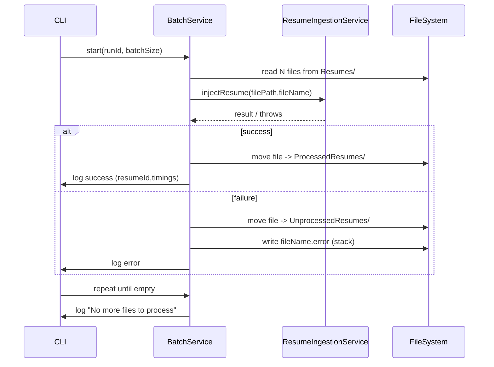

# Batch Resume Ingest Utility — Design Document

## 1. Utility Overview

A CLI utility to ingest resume PDFs in batches from the project root `Resumes` folder, calling the existing ingestion pipeline. Behavior:

- Reads up to `BATCH_INGEST_SIZE` files (env-driven, default `5`, max `10`).
- Uses `ResumeIngestionService.injectResume(filePath, fileName)` for full pipeline (extract → parse → embed → insert).
- On success: move file to `ProcessedResumes`.
- On failure: move file to `UnprocessedResumes` and write `#filename#.error` with full error details.
- Logs structured outcomes using the existing application logger; each run includes a `runId` UUID for traceability.

---

## 2. Recommended design

Principles

- Reuse existing services (parser, embedding, repository). Do not reimplement parsing or embedding.
- Single responsibility: CLI orchestrates batches and file movement.
- Safe file operations: atomic moves with copy+delete fallback.
- Default serial processing; make concurrency optional in a later enhancement.

Core components

- CLI entry: `src/utils/batchIngestCli.ts` — parse env/args, init logger & DB, run batches.
- `BatchIngestService`: small helper to read batches, call `injectResume`, handle success/failure and file moves.
- File helpers: `safeMoveFile(src,dest)`, `writeErrorFile(dir, filename, errorObj)`.
- Env: `BATCH_INGEST_SIZE` validated (default 5, max 10) in `src/config/env.ts`.

Processing flow (per batch)

1. Start run with `runId` and log start.
2. Read up to `BATCH_INGEST_SIZE` PDF filenames from `Resumes/` (filter `.pdf`, sort by mtime).
3. For each file:
   - Validate basic properties (extension, readable).
   - Call `injectResume(filePath, fileName)` and await result.
   - On success: move to `ProcessedResumes/` and log `resumeId` + timings.
   - On failure: move to `UnprocessedResumes/`, write `filename.error` with details, and log error.
4. Repeat until no files remain; log "No more files to process".

Sequence diagram



---

## 3. Suggested Folder Structure

- `Resumes/` — input folder (existing)
- `ProcessedResumes/` — move-on-success
- `UnprocessedResumes/` — move-on-failure
- `src/utils/batchIngestCli.ts` — CLI entry
- `src/services/BatchIngestService.ts` — helper orchestrator
- `src/utils/fileHelpers.ts` — `safeMoveFile`, `writeErrorFile`

Notes: create the `ProcessedResumes` and `UnprocessedResumes` folders at startup if missing.

---

## 4. File Responsibilities

- `src/utils/batchIngestCli.ts`
  - Parse env and CLI args, init logger & DB, generate `runId`, start `BatchIngestService`.

- `src/services/BatchIngestService.ts`
  - Batch loop: read N files, for each call `injectResume`, move files, write error files, log outcomes.

- `src/utils/fileHelpers.ts`
  - `safeMoveFile(src, dest)`: use `fs.rename`, fallback to copy + unlink.
  - `writeErrorFile(dir, filename, error)`: write `filename.error` (timestamp, runId, errorClass, message, stack, timings).

- `src/config/env.ts`
  - Expose and validate `BATCH_INGEST_SIZE` (default 5, cap 10).

- `ResumeIngestionService.injectResume(filePath, fileName)`
  - Existing orchestrator to call; returns `IngestionResult` (resumeId, timings, parsed fields).

- Logger
  - Use existing structured logger; include `runId`, `fileName`, `status`, `resumeId`, `timings`.

---

## 5. Running the utility

Add to `package.json` (dev):

```json
"scripts": {
  "batch:ingest": "ts-node src/utils/batchIngestCli.ts"
}
```

Run (dev):

```bash
npm run batch:ingest
```

Behavior:

- Reads `BATCH_INGEST_SIZE` from `.env` (default 5).
- Processes files from `Resumes/` in batches until empty.
- Logs progress in structured JSON.
- Prints/logs: "No more files to process" when done.

Optional CLI flags:

- `--batch-size N` override env for a single run
- `--once` process a single batch and exit
- `--concurrency N` future enhancement

---

## 6. Error Handling

Categories & actions

- Startup errors (fatal): missing env, DB connection fail, cannot create folders → log fatal, exit non-zero.

- Per-file validation error: invalid extension, unreadable file → move to `UnprocessedResumes`, write `.error`, log warning.

- Processing error (injectResume throws): move to `UnprocessedResumes`, write `.error` containing timestamp, runId, fileName, error class, message, stack, timings; log structured error with `errorCode`.

- File I/O error (move/write fail): attempt fallback; if still fails, log critical and leave original file in `Resumes/` for later retry.

Error file format (suggested):

- Human header: `Error ingesting {filename} — {ISO timestamp}`
- JSON block containing `runId`, `fileName`, `errorClass`, `message`, `stack`, and `ingestionTimings`.

Idempotency & retries

- Prefer `injectResume` idempotency: if duplicates are possible consider DB duplicate checks before final move.

Logging

- Per-file structured logs: `runId`, `fileName`, `status` (`processed`/`failed`), `resumeId`, `timings`, `errorCode` when applicable.

---

## 7. Implementation Plan (stepwise)

1. Discovery & scaffolding
   - Confirm `injectResume(filePath,fileName)` (done).
   - Ensure `Resumes/` exists; create `ProcessedResumes/` and `UnprocessedResumes/`.

2. Add env var & validation
   - Update `src/config/env.ts` to expose `BATCH_INGEST_SIZE` with default `5` and cap `10`.

3. CLI & `BatchIngestService`
   - Add `src/utils/batchIngestCli.ts` to initialize and run the batch loop.
   - Add `src/services/BatchIngestService.ts` implementing per-file handling.

4. IO helpers & error files
   - Implement `safeMoveFile` and `writeErrorFile` in `src/utils/fileHelpers.ts`.

5. Logging & run summary
   - Emit per-file logs and a final run summary (counts processed/failed/total, total time).

6. Scripts & docs
   - Add `npm run batch:ingest` and small README snippet.

7. Verification & testing
   - Manual: verify sample run, processed/unprocessed moves, `.error` files and DB inserts.
   - Optional automated integration test that stubs `injectResume`.

8. Optional enhancements
   - `CONCURRENCY` with rate-limiter, retry backoff for transient errors, backfill mode, dry-run.

---

## Quick Callouts

- Use existing `ResumeIngestionService.injectResume` — it encapsulates extract, parse, embed, insert.
- Default serial processing is safest; concurrency can be added later.
- Use robust file move with fallback to avoid cross-device issues.

---

_Created file: docs/batch-ingest-design.md_
